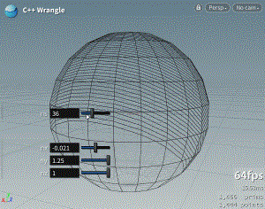
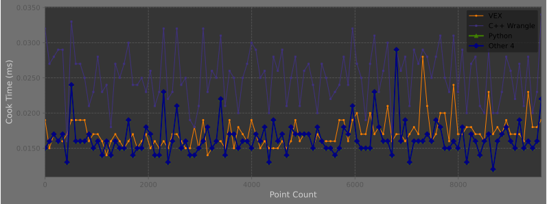

In my continuing quest to primarily use Houdini for its Real-time viewport for rendering, having lots of control over the viewport rendering seems like it could be promising. Although the new COPs system has a lot of potential, it still has a relatively high performance impact. There is comparatively little information about using the Houdini Development Kit on the way, and it feels "separate" from other Houdini documentation. The documentation, while exceptionally thorough, does not use the same format as the rest of the application and is a little less user-friendly.  The SideFX lab team has a [single](https://www.sidefx.com/tutorials/quick-tip-getting-started-with-the-hdk/) video on building a basic HDA using the HDK, which goes over setting up your build environment. 

I was inspired when I remembered there is a C++ wrangle by [Animatrix](https://vimeo.com/171189268) that basically takes care of the build environment for you.  [lecopivo](https://github.com/lecopivo) also authored an enhanced version of this HDA with a couple of extra features, but unfortunately it is a .hdanc file. I thought I would be able to get away with compiling the viewport rendering examples by basically stuffing them into the wrangle, but unfortunately it's not quite that simple. These HDAs act as wrappers for Houdini's `inlinecpp` python module. This module lets you create compiled C++ functions, which you can then call using python. 

## Hello World
Here's what a basic hello world looks like using the C++ wrangle:


## Read Geometry

We can pass the current geometry in as an argument. Note that the `hou.Geometry` class is equivalent to the C++ class [`GU_detail`](https://www.sidefx.com/docs/hdk/class_g_u___detail.html). `GU_detail` 


ROW_START
HALF_START
```cpp
void printGeoInfo(GU_Detail *gdp){
	GQ_Detail *gqd = new GQ_Detail ( gdp );
	std::cout << "number of points: " << gqd->nPoints() << std::endl;
	std::cout << "number of edges: " << gqd->nEdges() << std::endl;
	std::cout << "number of faces: " << gqd->nFaces() << std::endl;
	// Get a read-only handle to the "N" attribute (assumed to be a vector3 attribute)
    GA_ROHandleV3 nHandle(gdp, GA_ATTRIB_POINT, "N");

    // Check if the attribute exists
    if (!nHandle.isValid()) {
        std::cout << "Attribute 'N' not found on points." << std::endl;
        return;
    }

    // Iterate over all points and print the "N" values
    GA_Offset ptoff;
    GA_Iterator it(gdp->getPointRange());
    for (it.begin(); !it.atEnd(); ++it) {
        ptoff = *it;
        UT_Vector3 N = nHandle.get(ptoff);
        std::cout << "Point " << ptoff << " N: (" << N.x() << ", " << N.y() << ", " << N.z() << ")" << std::endl;
    }
}
```
HALF_END
HALF_START
```python
node = hou.node("..")
geo = hou.pwd( ).geometry ( ) # returns a hou.Geometry

myFirstModule.helloWorld()
printGeoInfo.printGeoInfo(geo)

```
HALF_END
ROW_END

## Slicing Example
Animatrix's C++ provides a more advanced example which slices the geometry `numslices` of times  using the `crease` function. How exactly you would know this is what the crease function does, I'm not exactly sure, as the documentation doesn't say much.  We can just grab some spare parameter values and feed them into our compiled function:

ROW_START
HALF_START
```cpp
void clip ( GU_Detail *gdp, float nx, float ny, float nz, float s, float size, int numslices )
{
	GQ_Detail *gqd = new GQ_Detail ( gdp );
	UT_Vector3 normal ( nx, ny, nz );
	float step = size / numslices;
	
	for ( int i = 0; NUM_SLICES_IT){
		gqd->crease ( normal, s, 0, NULL, NULL );
		s += step;
	}
	delete gqd;
}

```

HALF_END
HALF_START
```python
node = hou.node("..")
geo = hou.pwd().geometry()

nx, ny, nz = node.parmTuple("n").eval()
s = node.parm("s").eval()
size = node.parm("size").eval()
ns = node.parm("ns").eval()

m = hou.hmath.buildTranslate(geo.boundingBox().center())
geo.transform(m.inverted())

hdkclip.clip (geo,nx,ny,nz,s,size,ns)

geo.transform (m)
```
HALF_END
ROW_END


## SnapToGrid
There's quite a few GU_Detail methods that are great "out of the box",  like `snapToGrid`
ROW_START
HALF_START
```cpp
void snapToGrid(GU_Detail *gdp, int typeinput, float xlines, float ylines, float zlines,
                  float xoff,
                  float yoff,
                  float zoff,
                  float tol ){
    gdp -> snapGrid(typeinput, xlines, ylines, zlines, xoff, yoff, zoff, tol);
}
```
HALF_END
HALF_START
```python
node = hou.node("..")
geo = hou.pwd( ).geometry ( )
typeinput = node.parm("typeinput").eval()
xlines = node.parm("xlines").eval()
ylines = node.parm("ylines").eval()
zlines = node.parm("zlines").eval()
xoff = node.parm("xoff").eval()
yoff = node.parm("yoff").eval()
zoff = node.parm("zoff").eval()
tol = node.parm("tol").eval()
myPrintInfo.snapToGrid(geo, typeinput,xlines,ylines,zlines,xoff,yoff,zoff,tol)
```
HALF_END
ROW_END


## Performance Considerations

Ready to write some blazing fast code with your fancy new inline C++? Not so fast. Consider our wave example:



While C++ wrangles can provide significant performance improvements over VEX or Python, it's important to understand when and how to use them effectively. The overhead of compiling and calling C++ functions can sometimes outweigh the benefits for simple operations or small datasets. Always profile your specific use case to determine if the added complexity is worth the performance gain.

### Helpful Resources

- https://jurajtomori.wordpress.com/2017/12/01/creating-simple-c-openvdb-node-in-hdkcreating-simple-c-openvdb-node-in-hdk/


