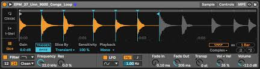
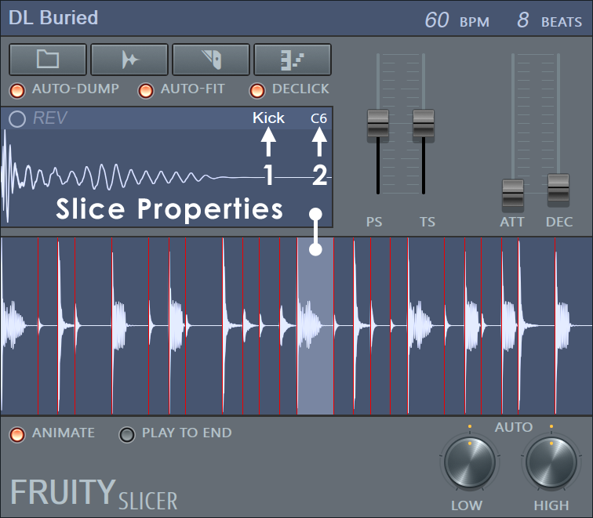
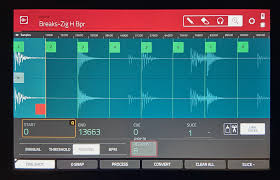
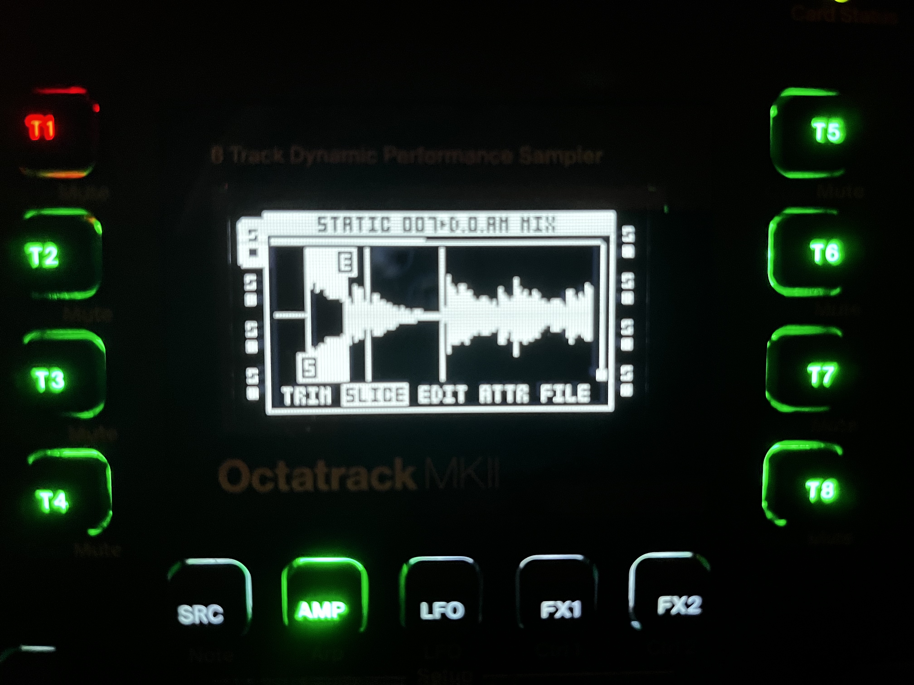

This is the first in what will hopefully be a couple of blog posts on a cross platform desktop processing application I've been working on called SoundStich. I've been working on it for about 3 months on and off, but felt now might be a good time to make a post about as I feel like the overall UI layout has taken shape.

So why build a desktop application?
 The approach I'm taking with this application is uniquely informed by my frustrations with current paradigms and tooling around sample management. As part of many audio workflows (both hardware and software based), I have a need to concatenate (join) audio files. Sample "packs" often come as a set of (20-100 typically) audio files, but working with these files individually can come with some headaches and workflow inneficenies. Additionally, while modern DAWs like Ableton now offer more "baked in" procedural tools (see Ableton 12's new MIDI Transformation/Generation tool), this approach has not been applied to samples.
 

I've just finished a much more fleshed out version of the UI, and it's definitely looking a bit more professional and well organized.

{: .shadow .ui-snapshot}

## Slicing UI References

When designing the slicing interface for SoundStitch, I drew inspiration from several existing audio slicing tools and workflows. Here are some key reference interfaces that influenced the design:

{: .shadow .reference-image}
*Ableton Live Simpler*
{: .reference-image-caption}

{: .shadow .reference-image}
*FL Studio Fruity Slicer*
{: .reference-image-caption}

{: .shadow .reference-image}
*MPC Slicing Interface*
{: .reference-image-caption}

{: .shadow .reference-image}
*Elektron Octatrack Slice View*
{: .reference-image-caption}

