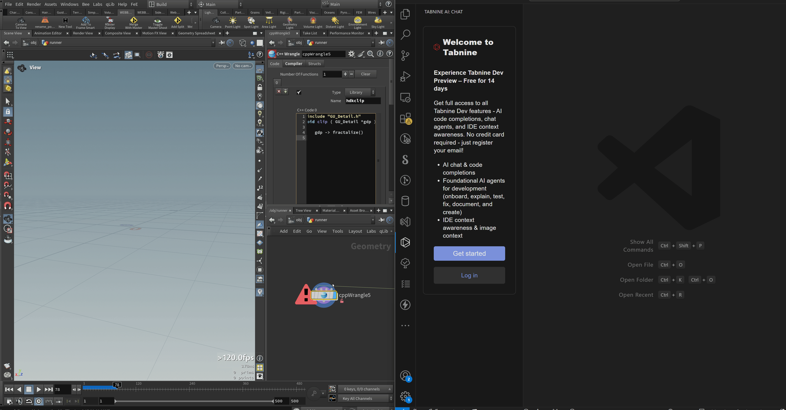

When working with the C++ Wrangle in Houdini, it's best to use an external editor for writing code. If you have Houdini Labs installed, setting this up is straightforward. The built-in tool provides a right-click menu option that lets you edit any parameter named **"script"** in an external editor.

To make this more flexible, you can create a shelf tool that allows you to edit code directly in the C++ Wrangle.

### Modifying ParmWatcher.py for C++ Wrangle Support

You'll need to modify the `ParmWatcher.py` script in your SideFX Labs installation to ensure that Houdini recognizes C++ snippets correctly. Specifically, update the `get_file_ext()` and `get_file_name()` functions to use the `.cc` extension instead of the default `.vfl`. This enables proper autocomplete support in VS Code.

```
C:\Users\Desktop\LabsInstall\SideFXLabs-20.5.294\scripts\python\HoudiniExprEditor\ParmWatcher.py
```


```python
def get_file_ext(parm, type_="parm"):
    """ Get the file name's extention according to parameter's temaplate.
    """
    if type_ == "python_node":

        return ".py"

    if type_ == "cpp_node":

        return ".cc"

    template = parm.parmTemplate()
    editorlang = template.tags().get("editorlang", "").lower()
    if editorlang == "vex":
        return ".vfl"
    elif editorlang == "python":
        return ".py"
    elif editorlang == "opencl":
        return ".cl"
    else:
        try:
            if parm.expressionLanguage() == hou.exprLanguage.Python:
                return ".py"
            else:
                return ".txt"

        except hou.OperationFailed:
            return ".txt"
```


```python
def get_file_name(data, type_="parm"):
    """ Construct an unique file name from a parameter with right extension.
    """
    if type_ == "parm":
        node = data.node()
        sid = str(node.sessionId())
        isCpp = "cpp" in node.type().name()
        if isCpp:
            file_name = sid + '_' + node.name() + '_' + data.name() + get_file_ext(data, type_="cpp_node")
            file_path = TEMP_FOLDER + os.sep + file_name
        else:
            file_name = sid + '_' + node.name() + '_' + data.name() + get_file_ext(data)
            file_path = TEMP_FOLDER + os.sep + file_name
    elif type_ == "python_node" or "extra_section|" in type_:
        sid = hashlib.sha1(data.path().encode("utf-8")).hexdigest()
        name = data.name()
        if "extra_section|" in type_:
            name += "_extraSection_" + type_.split('|')[-1]
        file_name = sid + '_' + name + get_file_ext(data, type_="python_node")
        file_path = TEMP_FOLDER + os.sep + file_name
    elif type_.startswith("__shelf_tool|"):
        language = type_.split('|')[-1]
        if language == "python":
            file_name = "__shelf_tool_" + data.name() + ".py"
        else:
            file_name = "__shelf_tool_" + data.name() + ".txt"
        file_path = TEMP_FOLDER + os.sep + file_name
    elif type_ == "__temp__python_source_editor":
        file_name = "__python_source_editor.py"
        file_path = TEMP_FOLDER + os.sep + file_name
    return file_path
```

Assuming you have VSCode configured as your external editor, you can change this setting in your user settings to have intellisense for your snippets:
```json
  "C_Cpp.default.includePath": [
    "C:\\Program Files\\Side Effects Software\\Houdini 20.5.550\\toolkit\\include\\**"
  ]
```

Autocomplete should work now for you! Unfortunately you'll need to add the header files in your VSCode snippet to get autocomplete, and then remove them in the Houdini parameter as this is not considered valid syntax. I'll probably add some means of automating this in the future. 




