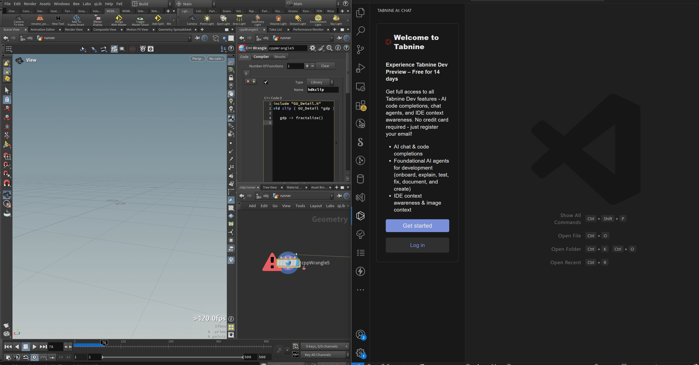

You'll probably want to use an external editor when writing code for the C++ wrangle. Fortunately this is easy enough to set up if you have Houdini labs installed.  The original tool provides you with a right click menu command that will allow you edit any param named "script" in an external editor. To make this more flexible you can create a shelf tool that will allow use to edit the code in the C++ wrangle.

You need to change the following functions in ParmWatcher.py so intellisense works properly.
```
C:\Users\\Desktop\LabsInstall\SideFXLabs-20.5.294\scripts\python\HoudiniExprEditor\ParmWatcher.py
```

`get_file_ext()`
```python
def get_file_ext(parm, type_="parm"):
    """ Get the file name's extention according to parameter's temaplate.
    """
    if type_ == "python_node":

        return ".py"

    if type_ == "cpp_node":

        return ".cc"

    template = parm.parmTemplate()
    editorlang = template.tags().get("editorlang", "").lower()
    if editorlang == "vex":
        return ".vfl"
    elif editorlang == "python":
        return ".py"
    elif editorlang == "opencl":
        return ".cl"
    else:
        try:
            if parm.expressionLanguage() == hou.exprLanguage.Python:
                return ".py"
            else:
                return ".txt"

        except hou.OperationFailed:
            return ".txt"
```

`get_file_name()`
```python
def get_file_name(data, type_="parm"):
    """ Construct an unique file name from a parameter with right extension.
    """
    if type_ == "parm":
        node = data.node()
        sid = str(node.sessionId())
        isCpp = "cpp" in node.type().name()
        if isCpp:
            file_name = sid + '_' + node.name() + '_' + data.name() + get_file_ext(data, type_="cpp_node")
            file_path = TEMP_FOLDER + os.sep + file_name
        else:
            file_name = sid + '_' + node.name() + '_' + data.name() + get_file_ext(data)
            file_path = TEMP_FOLDER + os.sep + file_name
    elif type_ == "python_node" or "extra_section|" in type_:
        sid = hashlib.sha1(data.path().encode("utf-8")).hexdigest()
        name = data.name()
        if "extra_section|" in type_:
            name += "_extraSection_" + type_.split('|')[-1]
        file_name = sid + '_' + name + get_file_ext(data, type_="python_node")
        file_path = TEMP_FOLDER + os.sep + file_name
    elif type_.startswith("__shelf_tool|"):
        language = type_.split('|')[-1]
        if language == "python":
            file_name = "__shelf_tool_" + data.name() + ".py"
        else:
            file_name = "__shelf_tool_" + data.name() + ".txt"
        file_path = TEMP_FOLDER + os.sep + file_name
    elif type_ == "__temp__python_source_editor":
        file_name = "__python_source_editor.py"
        file_path = TEMP_FOLDER + os.sep + file_name
    return file_path
```

Assuming you have VSCode configured as your external editor, you can change this setting in your user settings to have intellisense for your snippets:
```json
  "C_Cpp.default.includePath": [
    "C:\\Program Files\\Side Effects Software\\Houdini 20.5.550\\toolkit\\include\\**"
  ]
```

