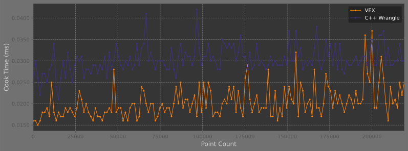

Ready to write some blazing fast code with your fancy new inline C++? Not so fast. Consider our wave example:
Ready to write some blazing fast code with your fancy new inline C++? Not so fast. Consider our wave example:

