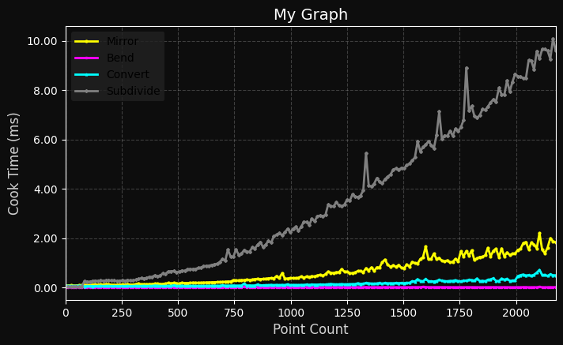

Here's an HDA that lets you easily generate customizable plots of node cooks times and save them to an SVG, PNG, PS, or PDF file. **You must have [matplotlib](https://matplotlib.org/) installed in your Houdini python libraries in order to use it**. See Paul Ambrosiussen's [tutorial](https://www.youtube.com/watch?v=cIEN50WuPoc) on getting pip installed for Houdini if you haven't already.

This HDA will record cook times when the "x_value" parameter changes. Typically, I use an expression like `npoints("my_operator")` for the X value, so I can see how cook times change with point counts.  Note that a new cook time will only be collected when the X value is higher than the last. 

You can customize the line color, width, and marker size, as well as all the labels and title for the graph. Here's the graph we just generated:

<a class="prc-Link-Link-85e08" href="https://github.com/wyhinton/wyhinton.github.io/raw/refs/heads/main/assets/images/my_hdas/cook_time_plot/cook_time_plot.hda">Download HDA</a>

<a class="prc-Link-Link-85e08" href="https://github.com/wyhinton/wyhinton.github.io/raw/refs/heads/main/assets/images/my_hdas/cook_time_plot/cook_time_plot_example.hip">Download Example</a>
